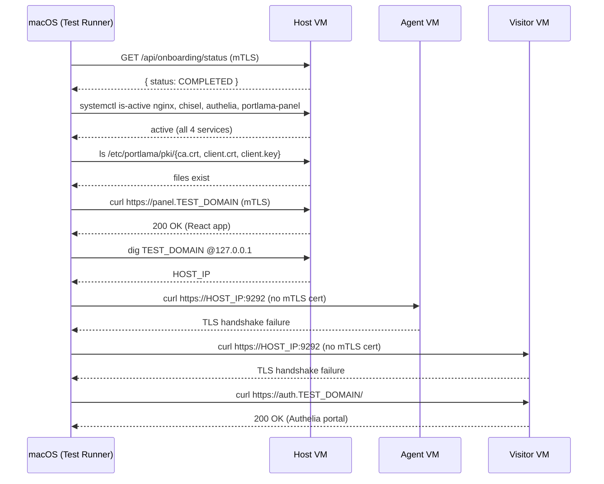
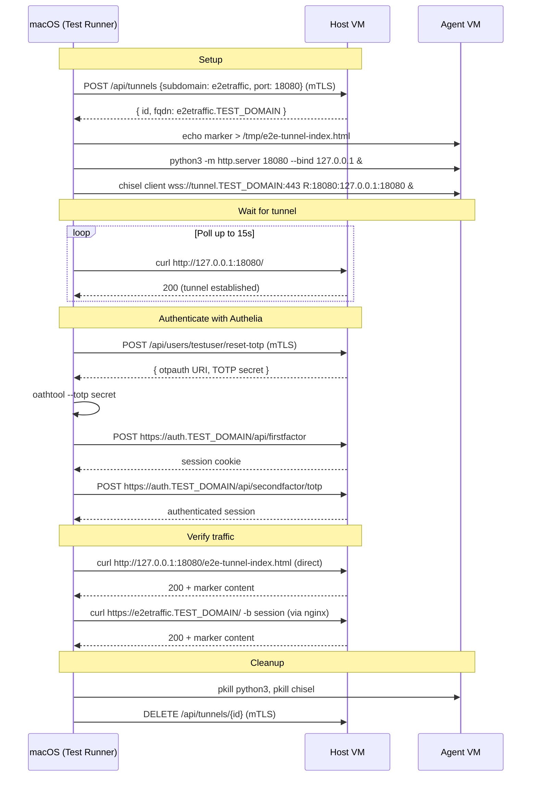
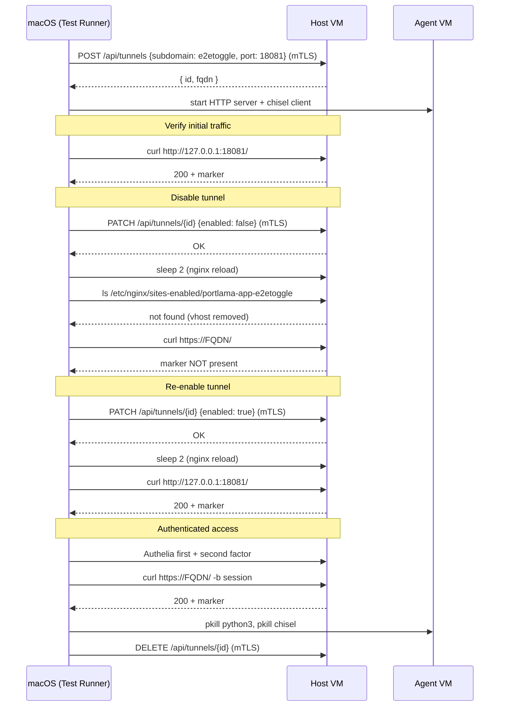
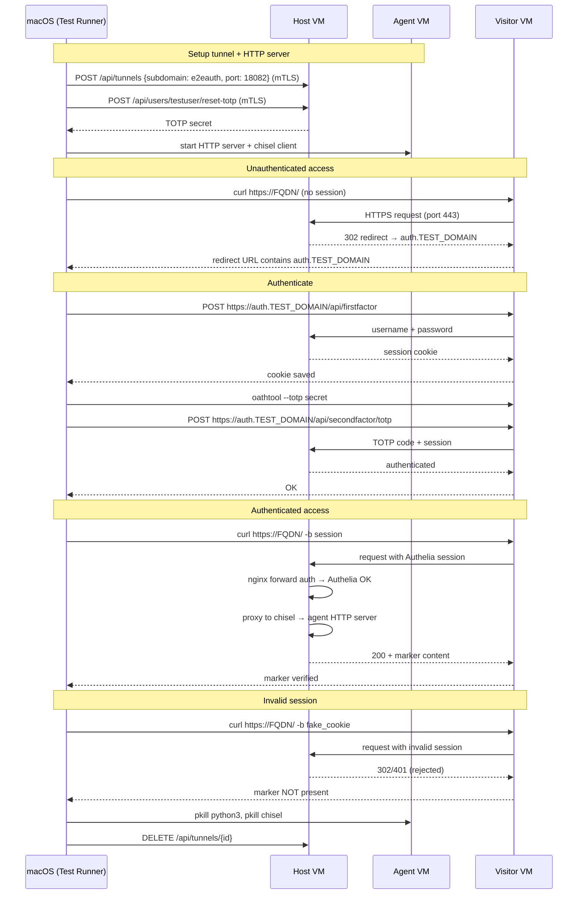
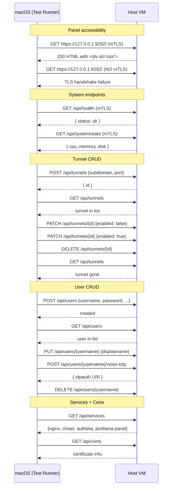
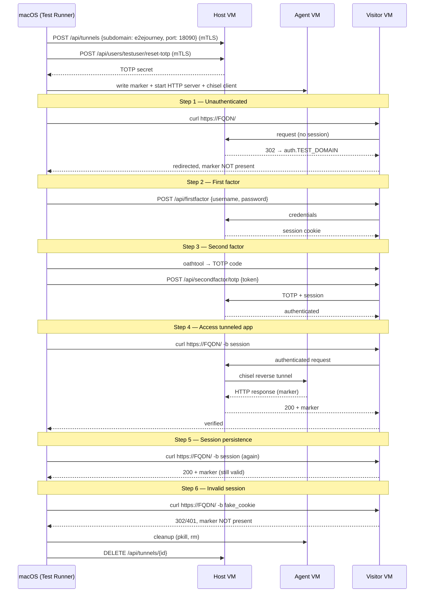
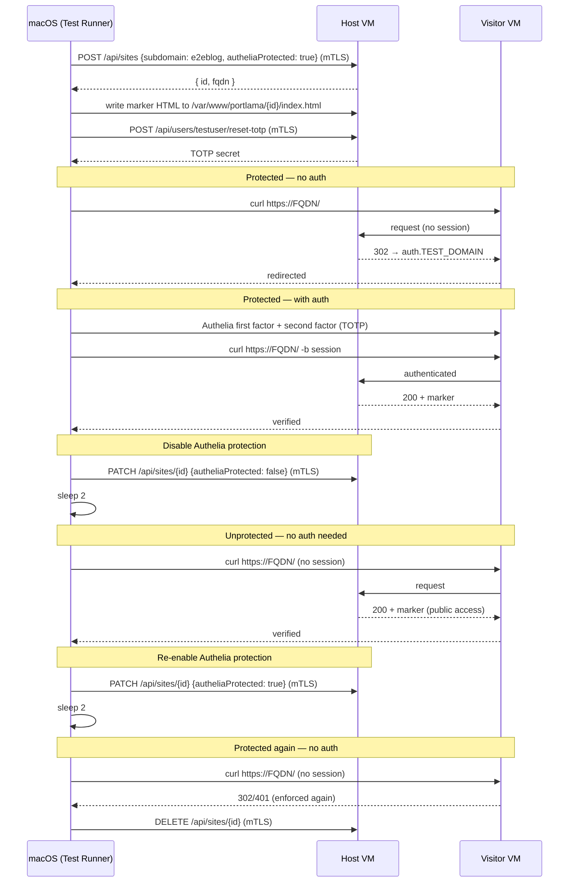
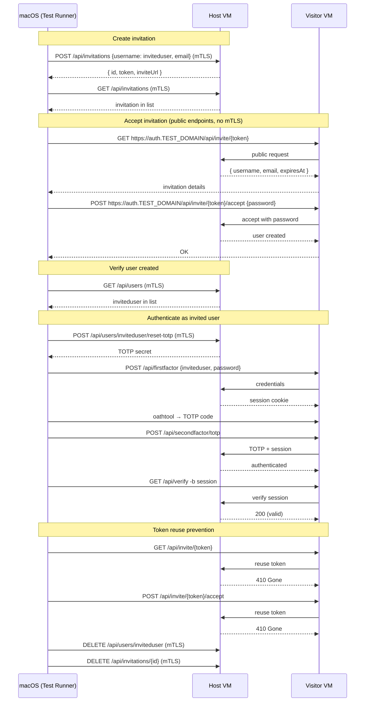

# Three-VM E2E Test — Sequence Diagrams

## Orchestration Flow

```mermaid
sequenceDiagram
    participant Mac as macOS (Developer)
    participant H as Host VM
    participant A as Agent VM
    participant V as Visitor VM

    rect rgb(40, 40, 60)
    note over Mac: Phase 1 — Create VMs
    Mac->>H: multipass launch 24.04
    Mac->>A: multipass launch 24.04
    Mac->>V: multipass launch 24.04
    end

    rect rgb(40, 60, 40)
    note over Mac,H: Phase 2 — Setup
    Mac->>Mac: npm pack create-portlama
    Mac->>H: transfer tarball
    Mac->>H: npm install -g + create-portlama --dev
    Mac->>H: transfer test scripts
    Mac->>A: transfer test scripts
    Mac->>V: transfer test scripts
    Mac->>H: setup-host.sh (dnsmasq, certbot shim, onboarding, test user, agent cert)
    H-->>Mac: credentials JSON
    Mac->>H: extract agent P12
    H-->>Mac: client.p12
    Mac->>A: transfer agent P12
    Mac->>A: setup-agent.sh (/etc/hosts, chisel, extract PEM certs)
    Mac->>V: setup-visitor.sh (curl, jq, oathtool, /etc/hosts)
    end

    rect rgb(60, 40, 40)
    note over Mac,H: Phase 3 — Single-VM E2E
    Mac->>H: run-all.sh (inside host)
    H-->>Mac: test results + logs
    end

    rect rgb(60, 60, 40)
    note over Mac,V: Phase 4 — Three-VM E2E
    Mac->>Mac: run-all.sh (from macOS, multipass exec into VMs)
    Mac->>H: tests 01–08 (via multipass exec)
    Mac->>A: tests 02–06 (via multipass exec)
    Mac->>V: tests 04, 06–08 (via multipass exec)
    end

    rect rgb(40, 40, 40)
    note over Mac: Phase 5 — Summary + Cleanup
    Mac->>Mac: collect logs, print results
    Mac-->>H: multipass delete (if --cleanup)
    Mac-->>A: multipass delete (if --cleanup)
    Mac-->>V: multipass delete (if --cleanup)
    end
```

## Test 01 — Onboarding Complete Verification

## Test 02 — Tunnel Traffic

## Test 03 — Tunnel Toggle

## Test 04 — Authelia Authentication (from Visitor)

## Test 05 — Admin Journey (Panel CRUD)

## Test 06 — Tunnel User Journey (Full 2FA from Visitor)

## Test 07 — Static Site Visitor Journey

## Test 08 — Invitation Journey

